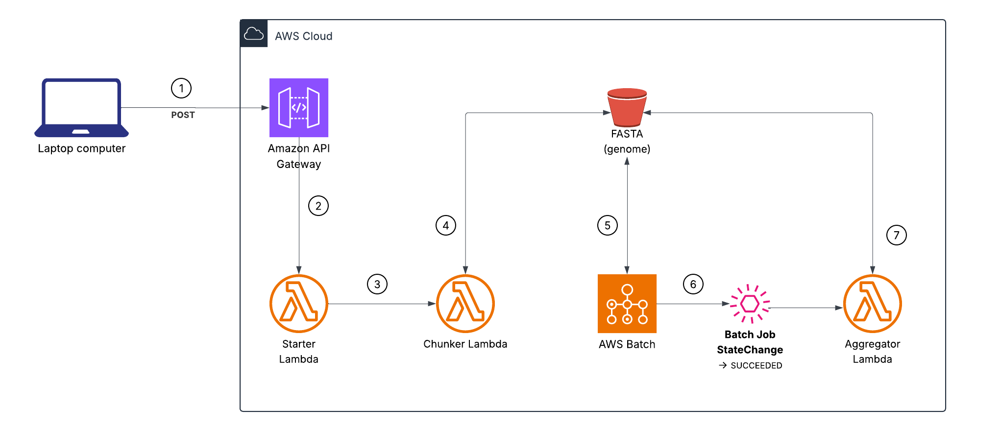

# genome-seq-batch-demo

## Fan-out/Fan-in Pattern Demonstration ##

With a single API call, this solution automatically breaks a massive genome file into bite-sized chunks, processes each piece in parallel in the cloud, and then gathers all those individual results into one cohesive report, making large-scale DNA analysis fast, hands-off, and easy to scale.




1. User sends request to **API Gateway** request with { bucket, key }, where bucket is the S3 bucket containing the FASTA Homo sapiens a GRCh38 genome file (3.34GB) (ftp://ftp.ncbi.nlm.nih.gov/genomes/all/annotation_releases/9606/GCF_000001405.40-RS_2024_08/GCF_000001405.40_GRCh38.p14_genomic.fna.gz) and key is the location of the file within the bucket.  

2. The `/chunk` resource triggers the **Starter Lambda** which immediately returns HTTP 200 and

3. asynchronously invokes the **Chunker Lambda**, a function that performs a *fan-out* breaks the genome file up into 32 files, 100MB each  

4. and stores them in the **S3 bucket** under `chunks`.

5. **AWS Batch** kicks off parallel Fargate batch tasks as one job.  
   - Each batch task steps over one slice of the genome.  `AWS_BATCH_JOB_ARRAY_INDEX` is injected into the container by Batch and the container downloads that specific byte range of the FASTA file from S3. 
   - The 100MB slice parses the FASTA text in-memory and computes whatever per-chunk metrics that have been configured like: Total bases in the slice, GC count (to compute GC%, which is a common genomics QC metric) and K-mer frequencies (counts of every length-K substring).   
   - It then writes out a small JSON file to s3://.../results/, containing that chunk’s total_bases, gc_count, and a dictionary of k-mer counts.

6. A **Batch Job StateChange SUCCEEDED** event is emitted from Batch and triggers the 

7. **Aggregator Lambda**, which performs a *"fan-in"* by 
    - reading each task's JSON and extracting its total_bases, gc_count, and kmer_counts map.  
    - It sums up total_bases across all chunks, gc_count across all chunks and merging all the per-chunk kmer_counts into one global frequency map. 
    - Calculates the overall GC percentage (total_gc ÷ total_bases) and 
    - wraps everything into a single JSON.  That final “master” JSON is written to s3://.../results/master.json


## Setup & Deployment ##

1. Clone the repo
``` bash
git clone https://github.com/mjones3/genome-seq-batch-demo.git
cd genome-seq-batch-demo
```
2. Run the deployment script
The `deploy.sh` script will:
  - Package any changed Lambda functions into ZIPs.
  - Build process-chunk Docker image and push to ECR.
  - `terraform init` & `terraform apply` to create all AWS resources. 
  
```
chmod +x deploy.sh
./deploy.sh
```
3. Retrieve API endpoint    
   After Terraform completes, note the output `starter_api_url` (e.g. https://abcde.execute-api.us-east-1.amazonaws.com/prod/chunk).


## Running the Demo ##

1. Upload a FASTA file to your S3 bucket (e.g. input/chr1.fasta).

2. Kick off chunking via HTTP:

    ``` bash
    curl -X POST \                  \
    -H 'Content-Type: application/json' \
    -d '{"bucket": "mjones3-genome-seq-batch-demo", "key": "input/chr1.fasta"}' \
    $STARTER_API_URL
    ```

3. Monitor progress
   - **S3:** watch `chunks/` for new `.chunk0000…` files and `results/` for per-chunk JSONs.
   - **AWS Batch:** check the job queue for array jobs and child statuses.
   - **CloudWatch Logs:** view logs for `chunkerFunction`, `process-chunk` container, and `aggregatorFunction`.

4. View final result
   - The merged summary will be in `s3://<bucket>/results/master.json`

## Cleanup ##

To tear down all AWS resources
``` bash
cd terraform
terraform destroy -auto-approve
```

## How It Fits the Fan‑Out/Fan‑In Pattern ##
- **Fan‑Out:** the FASTA file is sliced into many 100 MB chunks (via Chunker Lambda) and processed in parallel by AWS Batch array tasks.
- **Fan‑In:** the per‑chunk summaries are collected and aggregated back into a single summary JSON (via Aggregator Lambda), demonstrating how to scale out work and then recombine res
